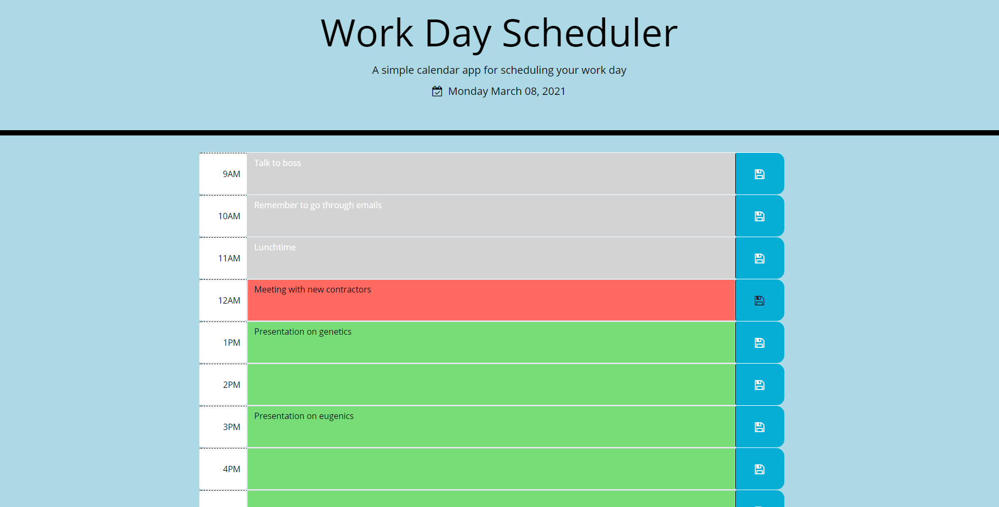

# Work Day Scheduler

Looking to make your daily life a little bit simplier? An army of sticky-notes cluttering your desk and conquering all your work domain? Take back your time and space with this simple work day scheduler app! Check it out in the deployed link below!

#### Deployed Link: https://hanlee-311.github.io/work-day-scheduler/

## How it Works

The scheduler comes ready with time slots for typical work hours 9AM to 5PM. Any upcoming hours will be coded with the color green, while your current hour will be in red. Any past hours will be dulled out, so you wil always know what hour you are on and what events are coming up. 

When you want to update the time slot with your activity for that hour, click on the slot and you will be able to write in your activity. Press the save button and vola! You have saved your activity to review later!

And don't worry- the scheduler will always present the date at the top of the page, so you will never have to second guess!

For your convience, when the day changes, your planner will clear and be ready for the following day. Try it out, and keep organized!

## Functions of Work Day Scheduler
- Date is displayed on the top of the page 
- Time slots in green are future hours. Time slots in red is the current hour. Time slots in grey are past hours. 
- Date and hour color will update real-time to reflect hour changes 
- User can write in their activities in the time slots and save
- Saved activities will reload when the user returns to the page
- Planner will clear itself when the day changes

